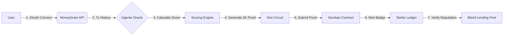

# Vigente Protocol 🛡️

  

> **Privacy-Preserving Reputation Infrastructure for RWA & Remittances**
> 
> Vigente transforms off-chain MoneyGram transaction history into verifiable on-chain credit scores using Zero-Knowledge cryptography on Stellar Soroban.

---

## 🏗 The Problem

The **$150B LatAm remittance market** is invisible to DeFi. 1.6M migrants in Chile alone send over $2B annually via MoneyGram, yet possess zero on-chain credit history. These "Credit Ghosts" are forced into predatory loans despite demonstrating consistent cash flow—a market failure at the intersection of Web2 finance and Web3 liquidity.

## 💡 The Solution: Vigente Protocol

Vigente is a **decentralized oracle and reputation layer** built on Soroban (Stellar Smart Contracts) that provides three core infrastructure components:

### 1. **Deterministic Oracle Node**
A production-grade oracle that ingests MoneyGram Access API data, executing deterministic scoring logic to translate remittance consistency into on-chain reputation tiers (Gold/Silver/Bronze) **without storing PII**.

### 2. **ZK-Reputation Circuits** *(In Development)*
Zero-Knowledge circuits (utilizing Noir/Zephyr) that allow users to generate cryptographic proofs of financial solvency. This enables verification of credit worthiness (e.g., "Monthly Volume > $500") **without revealing exact transaction amounts**.

### 3. **Blend-Composable SDK**
A developer-facing SDK that standardizes Vigente's `CreditBadge` tokens as collateral primitives, enabling any lending protocol (specifically Blend) to create under-collateralized pools for migrant demographics.

---

## 📐 Architecture



### Technical Flow:
1. **Data Ingestion**: User connects MoneyGram account via OAuth. Oracle fetches transaction history.
2. **Scoring**: Proprietary algorithm weights frequency and consistency over raw volume.
3. **Privacy Layer**: ZK-circuit generates proof of tier eligibility without exposing amounts.
4. **Minting**: Soroban contract verifies proof and mints non-transferable `CreditBadge` (SBT).
5. **DeFi Integration**: Badge acts as reputation collateral in Blend Protocol pools.

---

## 🚀 Key Features

### 🔄 Remittance-to-Credit Algorithm
Deterministic scoring engine that democratizes access to capital by rewarding consistency:
- **Volume Score**: Total USD transacted over 6 months
- **Frequency Score**: Number of transactions (rewards small, regular senders)
- **Consistency Score**: Standard deviation penalty (punishes irregular behavior)

### 🔒 ZKP-Ready Architecture
Current MVP uses SHA-256 commitment schemes. Roadmap includes:
- **Noir Circuits**: Range proofs for tier verification
- **Client-Side Proving**: Browser-based proof generation (no server trust)
- **Soroban Verifier**: On-chain verification of ZK-SNARK proofs

### 🧩 DeFi Composable
The `CreditBadge` is a Soroban-native token designed for ecosystem-wide composability:
- **Blend Protocol**: Reduces collateral requirements for badge holders
- **SAC Compatible**: Follows Stellar Asset Contract standards
- **Event-Driven**: Emits standardized events for indexers and analytics

---

## 🛠 Tech Stack

| Layer | Technology | Purpose |
|-------|------------|---------|
| **Smart Contracts** | Rust (Soroban SDK v21) | CreditBadge minting, verification, and storage |
| **Oracle** | Node.js + TypeScript | MoneyGram API integration and scoring engine |
| **ZK Circuits** | Noir Lang *(Roadmap)* | Privacy-preserving credit proofs |
| **Frontend** | Next.js 14 + Tailwind CSS | User dashboard and identity verification |
| **Network** | Stellar Testnet → Mainnet | 5-second finality, sub-cent fees |

---

## ⚡ Installation & Testing

### Prerequisites
- Node.js v18+
- Rust 1.75+ & Cargo
- Soroban CLI v21+

### 1️⃣ Clone Repository
```bash
git clone https://github.com/zzzbedream/VIGENTE-PROJECT.git
cd VIGENTE-PROJECT
```

### 2️⃣ Frontend Setup
```bash
cd web
npm install
npm run dev
# Open http://localhost:3000
```

### 3️⃣ Smart Contract Testing
```bash
cd contracts
cargo test
# Expected: test result: ok. 11 passed; 0 failed
```

### 4️⃣ Build Optimized WASM
```bash
cargo build --target wasm32-unknown-unknown --release
```

### 5️⃣ Deploy to Testnet
```bash
soroban contract deploy \
  --wasm target/wasm32-unknown-unknown/release/pyme_token_v1.wasm \
  --source [ADMIN_SECRET] \
  --network testnet
```

---

## 📊 Current Status (Testnet MVP)

### ✅ Completed
- **Oracle Node**: Functional MoneyGram data ingestion simulator
- **Scoring Engine**: Deterministic tier assignment (Gold/Silver/Bronze/Fail)
- **Soroban Contract**: `CreditBadge` minting and verification logic
- **Frontend Dashboard**: User identity flow with transaction visualization
- **API Layer**: `/api/oracle/score` and `/api/mint` endpoints

### 🧪 Validation Metrics
- **Tier A (Gold)**: Users with >$500/mo volume → 1000 pts ✅
- **Tier B (Silver)**: Users with >$300/mo volume → 673 pts ✅
- **Fail State**: Correctly rejects insufficient history ✅
- **Contract Tests**: 11/11 passing on Testnet ✅

---

## 🗺 Roadmap (SCF Build Tranches)

### **Tranche 1: Core Infrastructure** ($50k) - *Q2 2026*
- Production-grade Oracle Node with redundancy and signed feeds
- Soroban Reputation Standard (SAC-compliant SBT)
- Developer SDK (TypeScript) and documentation site

### **Tranche 2: Privacy Layer** ($60k) - *Q2 2026*
- ZK-Circuit implementation (Noir/Zephyr integration)
- Client-side proof generation (browser-based)
- Soroban verifier contract for ZK-SNARK proofs

### **Tranche 3: Mainnet & Liquidity** ($40k) - *Q3 2026*
- Blend Protocol pool integration (custom LTV ratios)
- Mainnet deployment with multi-sig admin controls
- Real-world pilot with 50 migrant users in Chile

---

## 🎯 Market Opportunity

| Metric | Value | Source |
|--------|-------|--------|
| LatAm Remittances (2024) | $150B | World Bank |
| Chile Migrant Population | 1.6M | INE Chile |
| Annual MoneyGram Volume (Chile) | $2B+ | MoneyGram Investor Relations |
| Unbanked/Underbanked Rate | 68% | CGAP Financial Inclusion Data |

**Thesis**: Vigente addresses the "Cold Start" problem for DeFi lending in emerging markets by creating a **privacy-preserving bridge** between legacy financial infrastructure (MoneyGram) and permissionless liquidity (Blend Protocol).

---

## 🔐 Security & Privacy

### Current Implementation
- **Data Hashing**: SHA-256 commitment of RUT (national ID) for privacy
- **Admin Controls**: Multi-signature authorization for badge minting
- **Time-Bound Badges**: 90-day expiry to enforce fresh data

### Roadmap (ZKP Integration)
- **Range Proofs**: Prove "score > threshold" without revealing exact score
- **Selective Disclosure**: Users choose which attributes to reveal to lenders
- **On-Chain Verification**: Trustless proof checking via Soroban verifier

---

## 🤝 Contributing

We welcome contributions! Please see our [CONTRIBUTING.md](./CONTRIBUTING.md) for guidelines.

### Development Priorities
1. **Noir Circuit Development**: ZK proof implementation
2. **Oracle Hardening**: Rate limiting and redundancy
3. **Blend Integration**: SDK for lending pool configuration

---

## 📄 License

This project is licensed under the **MIT License** - see [LICENSE](./LICENSE) file for details.

---

## 🏆 Acknowledgments

Built with support from:
- **Stellar Community Fund (SCF)** - Build Award Track
- **GitHub Student Developer Pack** - Infrastructure credits
- **MoneyGram Access API** - Remittance data access

---

<p align="center">
  <strong>Vigente Protocol</strong><br/>
  Privacy-Preserving Reputation Infrastructure for the Next Billion Users<br/>
  <a href="https://vigente-hackathon-final.vercel.app/landing">Live Demo</a> • 
  <a href="https://github.com/zzzbedream/VIGENTE-PROJECT">GitHub</a> • 
  <a href="https://stellar.expert/explorer/testnet">Testnet Explorer</a>
</p>
